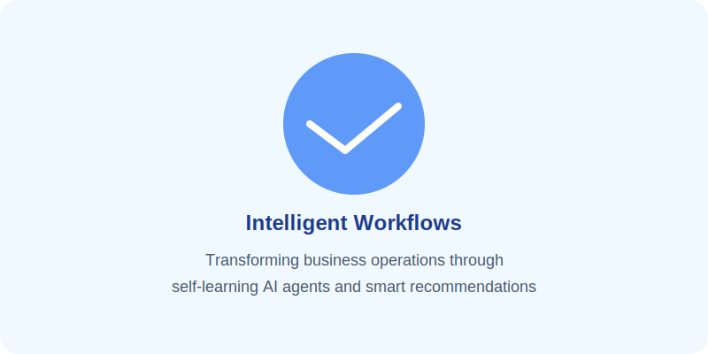
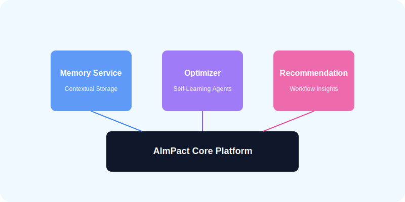
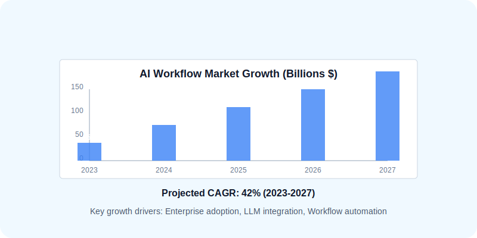

{/* 
  This MDX file can be imported into presentation software like PowerPoint or Google Slides. 
  Each section marked with '---' represents a new slide.
*/}

{/* Slide 1: Title Slide */}
<section className="slide title-slide">
  
  
  # AImPact Platform
  ## Intelligent Workflows for the Enterprise
  
  Robert Kopi, Founder & CEO  
  May 2025  
</section>

---

{/* Slide 2: Vision & Problem */}
<section className="slide vision-slide">
  <h2>Vision & Problem</h2>
  
  

    

      <h3>The Problem</h3>
      <ul>
        <li>Enterprises struggle with inefficient AI workflow implementation</li>
        <li>85% of AI projects don't reach production</li>
        <li>Constant LLM retraining & prompt engineering costs</li>
        <li>Siloed knowledge within organizations</li>
      </ul>
    

    
    

      <h3>Our Vision</h3>
      
A self-learning AI platform that grows alongside your business, continuously improving workflows without constant human intervention.

      
      
    

  

</section>

---

{/* Slide 3: Product Overview (Modules) */}
<section className="slide product-slide">
  <h2>Produktübersicht: Die Module</h2>
  
  
  
  

    

      <h3>Memory Service</h3>
      
Persistent context storage with vector database integration for semantic retrieval across user sessions.

    

    
    

      <h3>Optimizer</h3>
      
Self-learning agents using reinforcement learning from human feedback to continuously improve responses.

    

    
    

      <h3>Recommendation Engine</h3>
      
Intelligent suggestions for workflow optimization based on performance metrics and user behavior.

    

  

</section>

---

{/* Slide 4: Product Demo */}
<section className="slide demo-slide">
  <h2>Product Demo: "Make Better" Button</h2>
  
  

    

      <h3>Key Features</h3>
      <ul>
        <li>One-click workflow improvements</li>
        <li>Contextual recommendations</li>
        <li>Preview changes before applying</li>
        <li>Learns from user choices</li>
      </ul>
    

    
    

      

        

          [Interactive Product Demo]
        

      

    

  

  
  
* Live demo available upon request

</section>

---

{/* Slide 5: Market Analysis */}
<section className="slide market-slide">
  <h2>Marktanalyse & Wettbewerb</h2>
  
  
  
  

    

      <h3>Competitive Landscape</h3>
      <table className="competitor-table">
        <thead>
          <tr>
            <th>Competitor</th>
            <th>Self-learning</th>
            <th>Memory</th>
            <th>Recommendations</th>
          </tr>
        </thead>
        <tbody>
          <tr>
            <td>AImPact</td>
            <td>✓</td>
            <td>✓</td>
            <td>✓</td>
          </tr>
          <tr>
            <td>Competitor A</td>
            <td>✓</td>
            <td>-</td>
            <td>-</td>
          </tr>
          <tr>
            <td>Competitor B</td>
            <td>-</td>
            <td>✓</td>
            <td>-</td>
          </tr>
          <tr>
            <td>Competitor C</td>
            <td>-</td>
            <td>-</td>
            <td>✓</td>
          </tr>
        </tbody>
      </table>
    

    
    

      <h3>Target Markets</h3>
      <ul>
        <li>Enterprise IT departments (€2.8B)</li>
        <li>Financial services (€3.5B)</li>
        <li>Healthcare providers (€2.1B)</li>
        <li>Manufacturing & logistics (€4.2B)</li>
      </ul>
    

  

</section>

---

{/* Slide 6: Business Model */}
<section className="slide business-model-slide">
  <h2>Business Model & Revenue Streams</h2>
  
  
  
  

    

      <h3>Additional Revenue Streams</h3>
      <ul>
        <li>Implementation services (15-20% margin)</li>
        <li>Custom module development (40-60% margin)</li>
        <li>Training & certification (70-80% margin)</li>
        <li>Marketplace commission (30%)</li>
      </ul>
    

    
    

      <h3>Go-to-Market Strategy</h3>
      <ul>
        <li>Direct enterprise sales team</li>
        <li>Technology partnerships (AWS, Azure, GCP)</li>
        <li>Industry-specific solution packages</li>
        <li>Developer community & hackathons</li>
      </ul>
    

  

</section>

---

{/* Slide 7: Roadmap & Milestones */}
<section className="slide roadmap-slide">
  <h2>Roadmap & Meilensteine</h2>
  
  

    

      
Q1 2025

      

        <h3>MVP Launch</h3>
        <ul>
          <li>Core platform</li>
          <li>Memory service</li>
          <li>Basic optimizer</li>
          <li>3 pilot customers</li>
        </ul>
      

    

    
    

      
Q2 2025

      

        <h3>Market Entry</h3>
        <ul>
          <li>Full recommendation engine</li>
          <li>Enterprise auth & security</li>
          <li>Multi-tenant architecture</li>
          <li>10 paying customers</li>
        </ul>
      

    

    
    

      
Q3 2025

      

        <h3>Expansion</h3>
        <ul>
          <li>Marketplace launch</li>
          <li>API partner program</li>
          <li>Advanced analytics</li>
          <li>25 paying customers</li>
        </ul>
      

    

    
    

      
Q4 2025

      

        <h3>Scale</h3>
        <ul>
          <li>International expansion</li>
          <li>Industry verticalization</li>
          <li>Enterprise SLAs</li>
          <li>50+ paying customers</li>
        </ul>
      

    

  

</section>

---

{/* Slide 8: Financial Forecast */}
<section className="slide financials-slide">
  <h2>Finanzkennzahlen-Prognose</h2>
  
  

    

      <h3>5-Year Revenue Projection (€M)</h3>
      <table className="financial-table">
        <thead>
          <tr>
            <th>Year</th>
            <th>2025</th>
            <th>2026</th>
            <th>2027</th>
            <th>2028</th>
            <th>2029</th>
          </tr>
        </thead>
        <tbody>
          <tr>
            <td>ARR</td>
            <td>0.8</td>
            <td>3.2</td>
            <td>8.5</td>
            <td>16.7</td>
            <td>28.4</td>
          </tr>
          <tr>
            <td>Services</td>
            <td>0.3</td>
            <td>0.9</td>
            <td>1.8</td>
            <td>3.2</td>
            <td>5.1</td>
          </tr>
          <tr>
            <td>Total</td>
            <td>1.1</td>
            <td>4.1</td>
            <td>10.3</td>
            <td>19.9</td>
            <td>33.5</td>
          </tr>
        </tbody>
      </table>
    

    
    

      <h3>Key Metrics</h3>
      <ul>
        <li>Break-even: Q4 2026</li>
        <li>ARR CAGR: 142%</li>
        <li>Gross margin: 75-80%</li>
        <li>LTV:CAC ratio: 4.2:1</li>
        <li>Customer churn: &lt;5%</li>
      </ul>
      
      <h3>Cash Flow (€M)</h3>
      

        

        

        

        

        

      

    

  

</section>

---

{/* Slide 9: Use of Funds */}
<section className="slide use-of-funds-slide">
  <h2>Use of Funds</h2>
  
  

    

      

        

        

        

        

        
        
R&D (45%)

        
Sales (25%)

        
Marketing (15%)

        
G&A (15%)

      

    

    
    

      <h3>Funding Requirements</h3>
      
We are raising <strong>€3.5 million</strong> in Series A funding to:

      <ul>
        <li>Expand engineering team (8 new hires)</li>
        <li>Build enterprise sales organization</li>
        <li>Accelerate product development</li>
        <li>Expand marketing and customer acquisition</li>
        <li>18-month runway</li>
      </ul>
    

  

</section>

---

{/* Slide 10: Team */}
<section className="slide team-slide">
  <h2>Team & Ask</h2>
  
  

    

      

      <h3>Robert Kopi</h3>
      
Founder & CEO

      
10+ years in enterprise SaaS • Previously led AI initiatives at TechCorp • MS in Computer Science

    

    
    

      

      <h3>Dr. Sophia Chen</h3>
      
CTO

      
Former ML Research Lead at OpenAI • Ph.D. in Machine Learning • 15+ publications on reinforcement learning

    

    
    

      

      <h3>Michael Bauer</h3>
      
VP of Sales

      
20+ years enterprise sales experience • Built GTM at 2 successful SaaS exits • Deep network in finance and healthcare

    

  

  
  

    <h3>Key Advisors</h3>
    <ul className="advisor-list">
      <li><strong>Prof. Julia Müller</strong> – AI Ethics & Governance, TU Munich</li>
      <li><strong>Markus Weber</strong> – Former CIO, Deutsche Telekom</li>
      <li><strong>Sarah Johnson</strong> – Partner, Enterprise Ventures</li>
    </ul>
  

  
  

    <h3 style={{ margin: '0 0 10px 0', color: '#2B6CB0' }}>Investment Opportunity</h3>
    
<strong>€3.5M Series A</strong> at €15M post-money valuation

    
Contact: <a href="mailto:robert.kopi@aimpact.io">robert.kopi@aimpact.io</a>

  

</section>

---

{/* Slide 11: Thank You & Contact */}
<section className="slide thank-you-slide">
  <h1>Thank You</h1>
  
  
Transforming Business Operations through Intelligent Workflows

  
  

    
<strong>Robert Kopi</strong>

    
Founder & CEO

    
Email: robert.kopi@aimpact.io

    
Phone: +49 (0) 123 456 7890

    
Web: www.aimpact.io

  

  
  

    
Schedule a demo: <a href="https://calendly.com/aimpact-demo">calendly.com/aimpact-demo</a>

  

</section>

{/* 
  Styling for slide transitions and responsiveness can be added through
  CSS in a separate file or inline here if needed.
*/}
